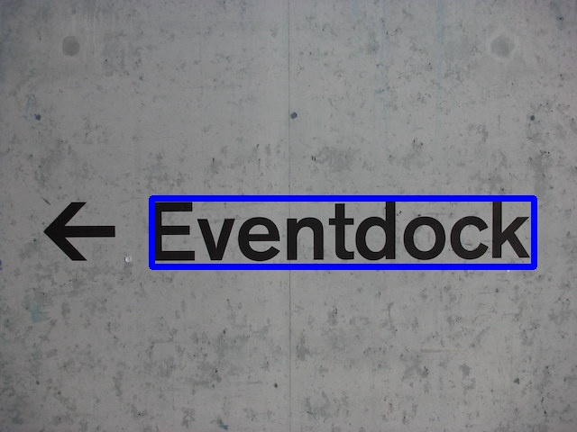

# keras-ocr
This is a slightly polished and packaged version of the [Keras CRNN implementation](https://github.com/kurapan/CRNN) and the published [CRAFT text detection model](https://github.com/clovaai/CRAFT-pytorch). It provides a high level API for training a text detection and OCR pipeline.

## Getting Started

### Installation
```bash
# To install from master
pip install git+https://github.com/faustomorales/keras-ocr.git#egg=keras-ocr

# To install from PyPi
pip install keras-ocr
```

### Using

#### Using pretrained text detection and recognition models
The package ships with an easy-to-use implementation of the CRAFT text detection model from [this repository](https://github.com/clovaai/CRAFT-pytorch) and the CRNN recognition model from [this repository](https://github.com/kurapan/CRNN).

```python
import matplotlib.pyplot as plt

import keras_ocr

# keras-ocr will automatically download pretrained
# weights for the detector and recognizer.
detector = keras_ocr.detection.Detector()
recognizer = keras_ocr.recognition.Recognizer()

image = keras_ocr.tools.read('tests/test_image.jpg')

# Boxes will be an Nx4x2 array of box quadrangles
# where N is the number of detected text boxes.
# Predictions is a list of (string, box) tuples.
boxes = detector.detect(images=[image])[0]
predictions = recognizer.recognize_from_boxes(image=image, boxes=boxes)

# Plot the results.
fig, (ax1, ax2) = plt.subplots(ncols=2, figsize=(10, 10))
canvas = keras_ocr.detection.drawBoxes(image, boxes)
ax1.imshow(image)
ax2.imshow(canvas)

for text, box in predictions:
    ax2.annotate(s=text, xy=box[0], xytext=box[0] - 50, arrowprops={'arrowstyle': '->'})
```

