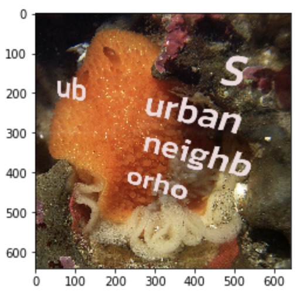
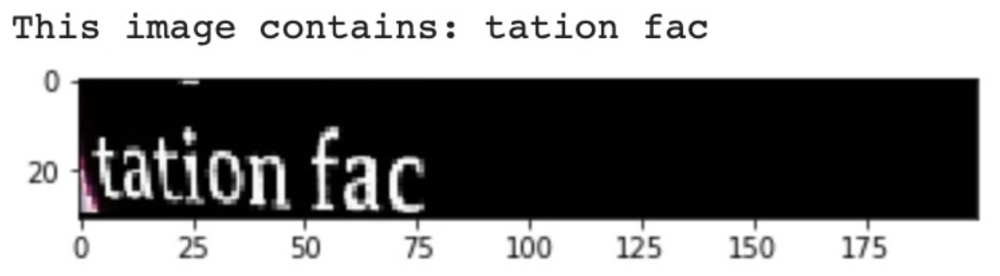
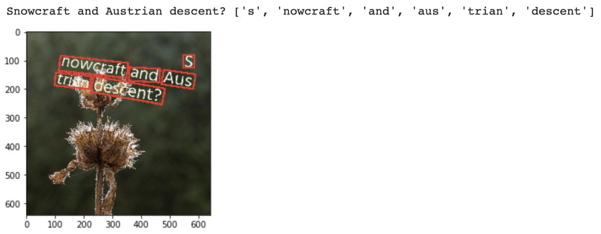

Complete end-to-end training
============================

You may wish to train your own end-to-end OCR pipeline. Here's an example for
how you might do it. Note that the image generator has many options not
documented here (such as adding backgrounds and image augmentation). Check
the documentation for the `keras_ocr.tools.get_image_generator` function for more details.

Please note that, right now, we use a very simple training mechanism for the
text detector which seems to work but does not match the method used in the
original implementation.

An interactive version of this example on Google Colab is provided `here
<https://colab.research.google.com/drive/19dGKong-LraUG3wYlJuPCquemJ13NN8R>`_.

Generating synthetic data
*************************

First, we define the alphabet that encompasses all characters we want our model to be able to detect and recognize. Below we designate our alphabet as the numbers 0-9, upper- and lower-case letters, and a few puncuation marks. For the recognizer, we will actually only predict lowercase letters because we know some fonts print lower- and upper-case characters with the same glyph.

In order to train on synthetic data, we require a set of fonts and backgrounds. :code:`keras-ocr` includes a set of both of these which have been downloaded from Google Fonts and Wikimedia. The code to generate both of these sets is available in the repository under :code:`scripts/create_fonts_and_backgrounds.py`.

The fonts cover different languages which may have non-overlapping characters. :code:`keras-ocr` supplies a function (:code:`font_supports_alphabet`) to verify that a font includes the characters in an alphabet. We filter to only these fonts. We also exclude any fonts that are marked as `thin` in the filename because those tend to be difficult to render in a legible manner.

The backgrounds folder contains about just over 1,000 image backgrounds.

.. code-block:: python

    import zipfile
    import datetime
    import string
    import math
    import os

    import tqdm
    import matplotlib.pyplot as plt
    import tensorflow as tf
    import sklearn.model_selection

    import keras_ocr

    assert tf.test.is_gpu_available(), 'No GPU is available.'

    data_dir = '.'
    alphabet = string.digits + string.ascii_letters + '!?. '
    recognizer_alphabet = ''.join(sorted(set(alphabet.lower())))
    fonts = keras_ocr.data_generation.get_fonts(
        alphabet=alphabet,
        cache_dir=data_dir
    )
    backgrounds = keras_ocr.data_generation.get_backgrounds(cache_dir=data_dir)

With a set of fonts, backgrounds, and alphabet, we now build our data generators.

In order to create images, we need random strings. :code:`keras-ocr` has a simple method for this for English, but anything that generates strings of characters in your selected alphabet will do!

The image generator generates `(image, lines)` tuples where `image` is a HxWx3 image and `lines` is a list of lines of text in the image where each line is itself a list of tuples of the form :code:`((x1, y1), (x2, y2), (x3, y3), (x4, y4), c)`. `c` is the character in the line and :code:`(x1, y1), (x2, y2), (x3, y3),
(x4, y4)` define the bounding coordinates in clockwise order starting from the top left. You can replace this with your own generator, just be sure to match that function signature.

We split our generators into train, validation, and test by separating the fonts and backgrounds used in each.

.. code-block:: python

    text_generator = keras_ocr.data_generation.get_text_generator(alphabet=alphabet)
    print('The first generated text is:', next(text_generator))

    def get_train_val_test_split(arr):
        train, valtest = sklearn.model_selection.train_test_split(arr, train_size=0.8, random_state=42)
        val, test = sklearn.model_selection.train_test_split(valtest, train_size=0.5, random_state=42)
        return train, val, test

    background_splits = get_train_val_test_split(backgrounds)
    font_splits = get_train_val_test_split(fonts)

    image_generators = [
        keras_ocr.data_generation.get_image_generator(
            height=640,
            width=640,
            text_generator=text_generator,
            font_groups={
                alphabet: current_fonts
            },
            backgrounds=current_backgrounds,
            font_size=(60, 120),
            margin=50,
            rotationX=(-0.05, 0.05),
            rotationY=(-0.05, 0.05),
            rotationZ=(-15, 15)
        )  for current_fonts, current_backgrounds in zip(
            font_splits,
            background_splits
        )
    ]

    # See what the first validation image looks like.
    image, lines = next(image_generators[1])
    text = keras_ocr.data_generation.convert_lines_to_paragraph(lines)
    print('The first generated validation image (below) contains:', text)
    plt.imshow(image)

Build base detector and recognizer models
*****************************************

Here we build our detector and recognizer models. For both, we'll start with pretrained models. Note that for the recognizer, we freeze the weights in the backbone (all the layers except for the final classification layer).

.. code-block:: python

    detector = keras_ocr.detection.Detector(weights='clovaai_general')
    recognizer = keras_ocr.recognition.Recognizer(
        alphabet=recognizer_alphabet,
        weights='kurapan'
    )
    recognizer.compile()
    for layer in recognizer.backbone.layers:
        layer.trainable = False

Train the detector
******************

We are now ready to train our text detector. Below we use some simple defaults.

- Run training until we have no improvement on the validation set for 5 epochs.
- Save the best weights.
- For each epoch, iterate over all backgrounds one time.

The :code:`detector` object has a :code:`get_batch_generator` method which converts the :code:`image_generator`
(which returns images and associated annotations) into a :code:`batch_generator` that returns
:code:`X, y` pairs for training with :code:`fit_generator`.

If training on Colab and it assigns you a K80, you can only use batch size 1. But if you get a
T4 or P100, you can use larger batch sizes.

.. code-block:: python

    detector_batch_size = 1
    detector_basepath = os.path.join(data_dir, f'detector_{datetime.datetime.now().isoformat()}')
    detection_train_generator, detection_val_generator, detection_test_generator = [
        detector.get_batch_generator(
            image_generator=image_generator,
            batch_size=detector_batch_size
        ) for image_generator in image_generators
    ]
    detector.model.fit(
        detection_train_generator,
        steps_per_epoch=math.ceil(len(background_splits[0]) / detector_batch_size),
        epochs=1000,
        workers=0,
        callbacks=[
            tf.keras.callbacks.EarlyStopping(restore_best_weights=True, patience=5),
            tf.keras.callbacks.CSVLogger(f'{detector_basepath}.csv'),
            tf.keras.callbacks.ModelCheckpoint(filepath=f'{detector_basepath}.h5')
        ],
        validation_data=detection_val_generator,
        validation_steps=math.ceil(len(background_splits[1]) / detector_batch_size),
        batch_size=detector_batch_size
    )

Train the recognizer
********************

After training the text detector, we train the recognizer. Note that the recognizer expects images
to already be cropped to single lines of text. :code:`keras-ocr` provides a convenience method for
converting our existing generator into a single-line generator. So we perform that conversion.

.. code-block:: python

    max_length = 10
    recognition_image_generators = [
        keras_ocr.data_generation.convert_image_generator_to_recognizer_input(
            image_generator=image_generator,
            max_string_length=min(recognizer.training_model.input_shape[1][1], max_length),
            target_width=recognizer.model.input_shape[2],
            target_height=recognizer.model.input_shape[1],
            margin=1
        ) for image_generator in image_generators
    ]

    # See what the first validation image for recognition training looks like.
    image, text = next(recognition_image_generators[1])
    print('This image contains:', text)
    plt.imshow(image)

Just like the :code:`detector`, the :code:`recognizer` has a method for converting the image generator
into a :code:`batch_generator` that Keras' :code:`fit_generator` can use.

We use the same callbacks for early stopping and logging as before.

.. code-block:: python

    recognition_batch_size = 8
    recognizer_basepath = os.path.join(data_dir, f'recognizer_{datetime.datetime.now().isoformat()}')
    recognition_train_generator, recognition_val_generator, recognition_test_generator = [
        recognizer.get_batch_generator(
        image_generator=image_generator,
        batch_size=recognition_batch_size,
        lowercase=True
        ) for image_generator in recognition_image_generators
    ]
    recognizer.training_model.fit(
        recognition_train_generator,
        epochs=1000,
        steps_per_epoch=math.ceil(len(background_splits[0]) / recognition_batch_size),
        callbacks=[
            tf.keras.callbacks.EarlyStopping(restore_best_weights=True, patience=25),
            tf.keras.callbacks.CSVLogger(f'{recognizer_basepath}.csv', append=True),
            tf.keras.callbacks.ModelCheckpoint(filepath=f'{recognizer_basepath}.h5')
        ],
        validation_data=recognition_val_generator,
        validation_steps=math.ceil(len(background_splits[1]) / recognition_batch_size),
        workers=0,
        batch_size=recognition_batch_size
    )

Use the models for inference
****************************

Once training is done, you can use :code:`recognize` to extract text.

.. code-block:: python
    
    pipeline = keras_ocr.pipeline.Pipeline(detector=detector, recognizer=recognizer)
    image, lines = next(image_generators[0])
    predictions = pipeline.recognize(images=[image])[0]
    drawn = keras_ocr.tools.drawBoxes(
        image=image, boxes=predictions, boxes_format='predictions'
    )
    print(
        'Actual:', '\n'.join([' '.join([character for _, character in line]) for line in lines]),
        'Predicted:', [text for text, box in predictions]
    )
    plt.imshow(drawn)

