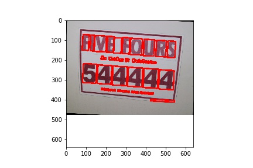

Fine-tuning the detector
========================

This example shows how to fine-tune the recognizer using an existing dataset. In this case,
we will use the text segmentation dataset from ICDAR 2013, available from
https://rrc.cvc.uab.es/?ch=1&com=downloads.

First, we download our dataset. :code:`keras-ocr` provides a convenience function for this,
which you are welcome to examine to understand how the dataset is downloaded and parsed.

An interactive version of this example on Google Colab is provided `here
<https://colab.research.google.com/drive/1wrIoPwtxISkW88hG2ZhFOLTVqT2aNj7M>`_.

.. code-block:: python

    data_dir = '.'

    import os
    import math
    import imgaug
    import numpy as np
    import matplotlib.pyplot as plt
    import sklearn.model_selection
    import tensorflow as tf

    import keras_ocr

    dataset = keras_ocr.datasets.get_icdar_2013_detector_dataset(
        cache_dir='.',
        skip_illegible=False
    )

Now we split the dataset into training and validation.

.. code-block:: python

    train, validation = sklearn.model_selection.train_test_split(
        dataset, train_size=0.8, random_state=42
    )
    augmenter = imgaug.augmenters.Sequential([
        imgaug.augmenters.Affine(
        scale=(1.0, 1.2),
        rotate=(-5, 5)
        ),
        imgaug.augmenters.GaussianBlur(sigma=(0, 0.5)),
        imgaug.augmenters.Multiply((0.8, 1.2), per_channel=0.2)
    ])
    generator_kwargs = {'width': 640, 'height': 640}
    training_image_generator = keras_ocr.datasets.get_detector_image_generator(
        labels=train,
        augmenter=augmenter,
        **generator_kwargs
    )
    validation_image_generator = keras_ocr.datasets.get_detector_image_generator(
        labels=validation,
        **generator_kwargs
    )

We can visualize what the samples look like pretty easily.

.. code-block:: python

    image, lines, confidence = next(training_image_generator)
    canvas = keras_ocr.tools.drawBoxes(image=image, boxes=lines, boxes_format='lines')
    plt.imshow(canvas)

Now we can build the detector and train it.

.. code-block:: python

    detector = keras_ocr.detection.Detector()

    batch_size = 1
    training_generator, validation_generator = [
        detector.get_batch_generator(
            image_generator=image_generator, batch_size=batch_size
        ) for image_generator in
        [training_image_generator, validation_image_generator]
    ]
    detector.model.fit_generator(
        generator=training_generator,
        steps_per_epoch=math.ceil(len(train) / batch_size),
        epochs=1000,
        workers=0,
        callbacks=[
            tf.keras.callbacks.EarlyStopping(restore_best_weights=True, patience=5),
            tf.keras.callbacks.CSVLogger(os.path.join(data_dir, 'detector_icdar2013.csv')),
            tf.keras.callbacks.ModelCheckpoint(filepath=os.path.join(data_dir, 'detector_icdar2013.h5'))
        ],
        validation_data=validation_generator,
        validation_steps=math.ceil(len(validation) / batch_size)
    )

Weights can be loaded into the model attribute of the detector. This is how you can reuse the weights later.

.. code-block:: python

    detector.model.load_weights(os.path.join(data_dir, 'detector_icdar2013.h5'))