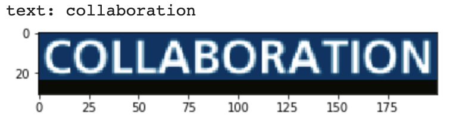
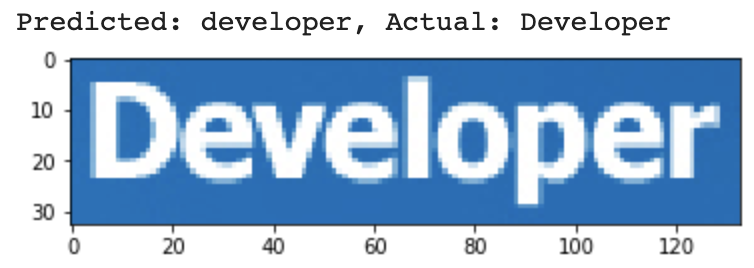

Fine-tuning the recognizer
==========================

This example shows how to fine-tune the recognizer using an existing dataset. In this case,
we will use the "Born Digital" dataset from https://rrc.cvc.uab.es/?ch=1&com=downloads

First, we download our dataset. Below we get both the training and test datasets, but
we only use the training dataset. The training dataset consists of a single folder
containing images, each of which has a single word in it.

An interactive version of this example on Google Colab is provided `here
<https://colab.research.google.com/drive/1GeGA_bvh1TCgYNJSkWTWt00CEwaD_Ocl>`_.

.. code-block:: python

    import random
    import string
    import math
    import itertools
    import os

    import numpy as np
    import imgaug
    import matplotlib.pyplot as plt
    import tensorflow as tf
    import sklearn.model_selection

    import keras_ocr

    assert tf.config.list_physical_devices('GPU'), 'No GPU is available.'

    train_labels = keras_ocr.datasets.get_born_digital_recognizer_dataset(
        split='train',
        cache_dir='.'
    )
    test_labels = keras_ocr.datasets.get_born_digital_recognizer_dataset(
        split='test',
        cache_dir='.'
    )
    train_labels = [(filepath, box, word.lower()) for filepath, box, word in train_labels]
    test_labels = [(filepath, box, word.lower()) for filepath, box, word in test_labels]

We next build our recognizer, using the default options to get a pretrained model.

.. code-block:: python

    recognizer = keras_ocr.recognition.Recognizer()
    recognizer.compile()

We need to convert our dataset into the format that :code:`keras-ocr` requires. To 
do that, we have the following, which includes support for an augmenter to
generate synthetically altered samples. Note that this code is set up to skip
any characters that are not in the recognizer alphabet and that all labels
are first converted to lowercase.

.. code-block:: python

    batch_size = 8
    augmenter = imgaug.augmenters.Sequential([
        imgaug.augmenters.GammaContrast(gamma=(0.25, 3.0)),
    ])

    train_labels, validation_labels = sklearn.model_selection.train_test_split(train_labels, test_size=0.2, random_state=42)
    (training_image_gen, training_steps), (validation_image_gen, validation_steps) = [
        (
            keras_ocr.datasets.get_recognizer_image_generator(
                labels=labels,
                height=recognizer.model.input_shape[1],
                width=recognizer.model.input_shape[2],
                alphabet=recognizer.alphabet,
                augmenter=augmenter
            ),
            len(labels) // batch_size
        ) for labels, augmenter in [(train_labels, augmenter), (validation_labels, None)]     
    ]
    training_gen, validation_gen = [
        recognizer.get_batch_generator(
            image_generator=image_generator,
            batch_size=batch_size
        )
        for image_generator in [training_image_gen, validation_image_gen]
    ]

As a sanity check, we show one of the samples.

.. code-block:: python

    image, text = next(training_image_gen)
    print('text:', text)
    plt.imshow(image)

Now we can run training.

.. code-block:: python

    callbacks = [
        tf.keras.callbacks.EarlyStopping(monitor='val_loss', min_delta=0, patience=10, restore_best_weights=False),
        tf.keras.callbacks.ModelCheckpoint('recognizer_borndigital.h5', monitor='val_loss', save_best_only=True),
        tf.keras.callbacks.CSVLogger('recognizer_borndigital.csv')
    ]
    recognizer.training_model.fit_generator(
        generator=training_gen,
        steps_per_epoch=training_steps,
        validation_steps=validation_steps,
        validation_data=validation_gen,
        callbacks=callbacks,
        epochs=1000,
    )

Finally, run inference on a test sample.

.. code-block:: python

    image_filepath, _, actual = test_labels[1]
    predicted = recognizer.recognize(image_filepath)
    print(f'Predicted: {predicted}, Actual: {actual}')
    _ = plt.imshow(keras_ocr.tools.read(image_filepath))

You can load weights back into a model using `recognizer.model.load_weights()`.

.. code-block:: python

    recognizer.model.load_weights('recognizer_borndigital.h5')
